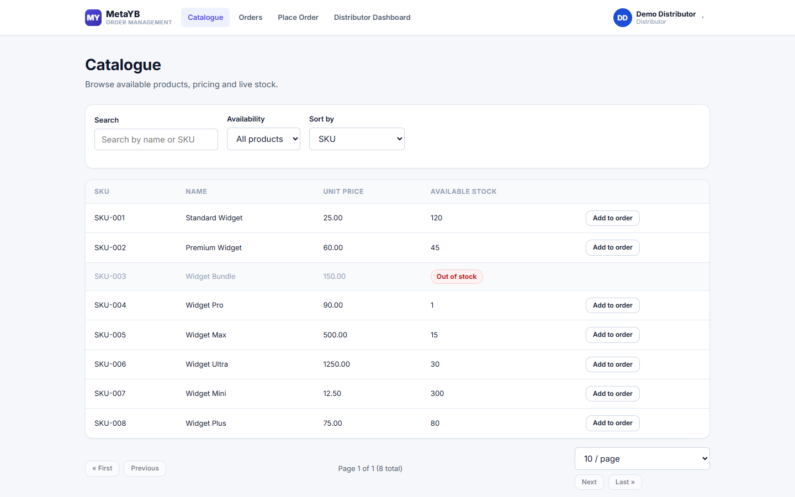
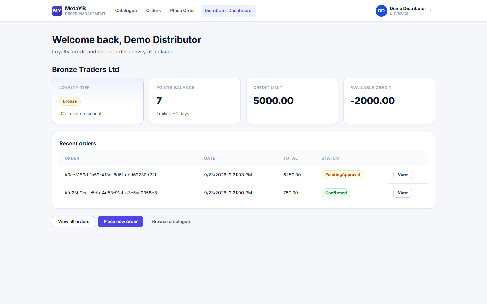
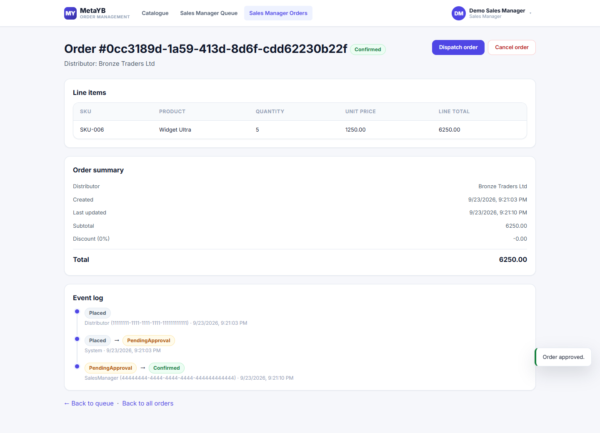

<!--
Audience: Head of Sales. Six slides (slide 6 optional). No architecture,
code or framework names. Screenshots are real captures of the running
application (pitch-assets/), taken with the seeded demo data after placing
and approving orders through the screens shown. A printable version of the
same deck is in pitch.pdf.
-->

# Slide 1 — The problem

Taking a distributor's order means answering three questions before anyone
can say yes: **Do we have the stock? Is the distributor within their credit
limit? What discount have they earned?**

When those checks are done by hand:

- the same stock can be promised to two distributors;
- a credit limit is missed — or a good order waits hours for a callback;
- loyalty discounts are applied inconsistently;
- every order has to be keyed again into the company's ERP system.

Distributors wait, the sales team chases paperwork, and nobody has one
reliable record of who changed what, and when.

---

# Slide 2 — Distributors see live stock and order in minutes

- The catalogue shows every product, its price and **the stock available
  right now**.
- Out-of-stock items stay visible, clearly marked, and can't be ordered —
  the system refuses them even if someone tries.
- "Add to order" builds a multi-item order; stock is held the moment it's
  placed, so it can't be sold twice.

---

# Slide 3 — Instant credit and loyalty decisions

- Each order is checked against the distributor's available credit the
  moment it's placed: **within credit → confirmed immediately**; over it →
  **held for a sales manager**, never silently accepted or lost.
- Distributors earn points on every confirmed order. Points from the last
  90 days set their tier — **Bronze, Silver (3% off) or Gold (6% off)** —
  and the discount is applied automatically to their next order.
- Distributors see their tier, points, credit and every order's status
  without phoning anyone.

---

# Slide 4 — The sales team stays in control

- An **approval queue** lists exactly the orders that need a decision:
  approve or reject, each with a quick confirmation.
- Sales managers see every order, move confirmed orders to **dispatched**
  and **delivered**, and can cancel an order before it ships — stock and
  loyalty points are put back automatically.
- Every change is recorded with **who made it and when**, and each update
  is sent on automatically for the ERP — no re-keying.

---

# Slide 5 — What it takes to go live

**Integration**
- Connect the automatic order updates to our ERP system: agree the message
  format with the ERP team and test it end to end, including what happens
  when the ERP is unavailable (updates are kept and resent automatically).

**Data migration**
- Load the real product list and stock, the distributor list with credit
  limits, and the last 90 days of confirmed orders so every distributor
  starts on the right tier.
- Create sign-ins for each distributor and sales manager. Today anyone can
  register themselves; before go-live, accounts must be issued by us only.

**Rollout**
- Pilot with a handful of distributors and one sales manager; confirm the
  credit, stock and discount outcomes match how we work today.
- Short training for the sales team, then open to all distributors.

---

# Slide 6 — Roadmap (optional)

- A screen for order updates the ERP could not accept, with one-click resend.
- Alerts to sales managers when an order is waiting for approval.
- Sales reporting: order volume by distributor, tier movement over time.
